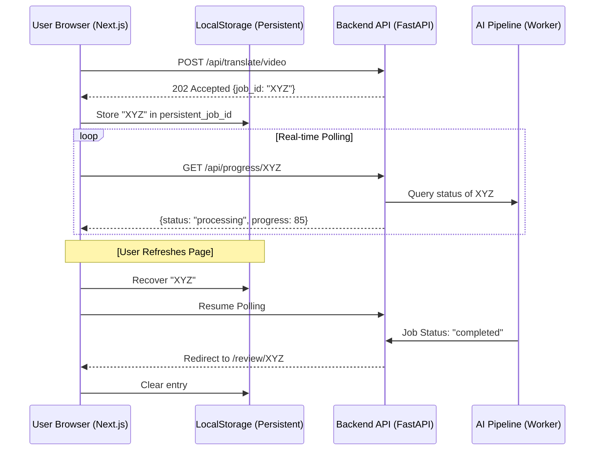

# Progress Tracking System: Technical Implementation and Evolution

> **Project:** Octavia Video Translator
> **Component:** End-to-End Synchronization Engine (Frontend to Backend Pipeline)
> **Status:** Production-Ready (Enhanced UI/UX)
> **Version:** 1.3.0

---

## Executive Summary

The Octavia progress tracking system is a critical infrastructure component designed to bridge the data-gap between backend AI pipelines and the user's dashboard. This specification details the transition to a **Standardized Premium UX** using high-fidelity glass loading states, real-time segment tracking for translations, and an intelligent transition between granular progress bars (for long video jobs) and interactive spinners (for fast subtitle jobs).

---

## 1. Architecture Flow

---

## 2. Discovery: Issues and Applied Solutions

Below is the definitive list of technical challenges encountered during the implementation of "Magic Mode" and the specific fixes applied.

### Issue 1: Transient State Loss (UX Reset)
*   **The Problem:** The activeJobId was stored in local React state. Any page refresh or accidental navigation caused the dashboard to reset to the "Upload Video" screen, orphaning the backend process.
*   **The Solution:** Implemented LocalStorage Hydration.
    *   **Action:** Created a useEffect hook in page.tsx that commits the job_id to persistent browser storage on start and attempts to recover it on mount.

### Issue 2: Demo Mode Invisibility (No Persistence)
*   **The Problem:** In demo mode, jobs were kept in a standard Python dictionary (jobs_db). If the backend server restarted (common during dev), all active translation context was destroyed.
*   **The Solution:** Implemented Local JSON Shadowing.
    *   **Action:** Developed backend/demo_jobs.json as a persistent fallback database specifically for demo environments.

### Issue 3: Variable Shadowing (UnboundLocalError)
*   **The Problem:** In translation_routes.py, the asyncio module import was being shadowed by a local variable named asyncio inside the worker scope. Processing would crash at the synthesis stage.
*   **The Solution:** Performed Namespace Sanitization.
    *   **Action:** Standardized the use of asyncio at the module level and ensured no local variable names conflicted with Python core libraries.

### Issue 4: Circuit Breaker Interference (False Failures)
*   **The Problem:** The progress endpoint was wrapped in a @with_retry circuit breaker that monitored Supabase health. Even if demo jobs were ready, a database hiccup would open the circuit and block all polling.
*   **The Solution:** Implemented Database Decoupling.
    *   **Action:** Modified the get_job_progress logic to bypass the Supabase retry-cycle when DEMO_MODE=true, prioritizing local file access.

### Issue 5: The "Black Hole" Completion (UI Loop)
*   **The Problem:** Upon reaching 100% completion, the system would clear its state but stay on the "Processing" page, essentially showing an empty upload screen instead of the result.
*   **The Solution:** Implemented Automatic Success Redirection.
    *   **Action:** Integrated `next/navigation` router logic. Once the status payload returns `completed`, a `router.push('/dashboard/subtitles/review')` is triggered with a short 2s delay.

### Issue 6: Background Task Scope Collisions
*   **The Problem:** In `translation_routes.py`, the `background_tasks` variable was undefined in certain scopes due to missing FastAPI dependency injection parameters.
*   **The Solution:** Parameter-Level Dependency Injection.
    *   **Action:** Explicitly added `background_tasks: BackgroundTasks` to the FastAPI endpoint signatures to ensure the lifecycle manager is correctly injected by the framework.

### Issue 7: Progress "Stall" Perception
*   **The Problem:** For fast-running tasks like subtitle generation (<30s), a granular progress bar that jumps in 20% increments felt broken or "stuck" at the 10% initialization phase.
*   **The Solution:** Standardized Liquid Glass Loading.
    *   **Action:** Transitioned from progress bars to premium animated spinners for low-latency tasks. Added granular status sub-text (e.g., "Translated 11/49 segments...") to provide high-fidelity feedback without the psychological friction of an "incremental" bar.

---

## 3. Technical Tradeoffs

| Implementation | Tradeoff | Rationale |
| :--- | :--- | :--- |
| **HTTP Polling** | Higher header overhead. | Protocol reliability and ease of debugging over stateful WebSocket complexities. |
| **JSON Fallback** | Disk I/O latency. | Critical for Database-less development and local-first testing. |
| **LocalStorage** | Device-specific. | Ensures individual user privacy without requiring server-side session tracking. |

---

## 4. Evolution Roadmap

1.  **Browser Notifications:** Service Worker integration to notify users when lip-syncing finishes if the tab is backgrounded.
2.  **Streaming Previews:** Displaying the first 10-15 seconds of the video as soon as the first chunk finishes synthesizing.
3.  **Automatic Purge:** A background worker to clean up demo_jobs.json entries older than 24 hours.

---

> **LunarTech-X Technical Spec.** Optimized for Notion, GitHub, and internal engineering wikis.
